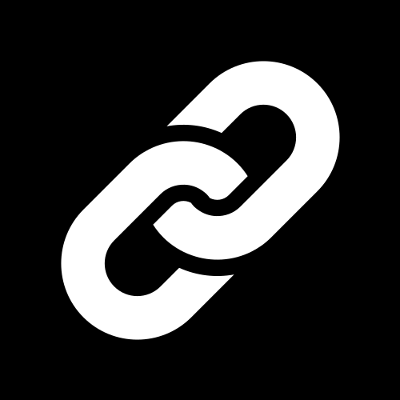

<div align="center">
 
</div>

<div align="center">
 <br \>
 <br \>
 <br \>
 </img>
 <h3><strong>Encurtador URL</strong></h3>
 <p>API pra encurtar URL de forma customizada</p>
</div>

---

## Sobre o Projeto

**Encurtador URL** é uma aplicação criada pra encurtar links de forma dinamica e customizada. 
Você pode acessar uma demonstração do site **NÃO FUNCIONAL** <a href="https://encurtador-url-hjen-n18q2z7m6-whoisleoos-projects.vercel.app">aqui</a>


---

## Ferramentas utilizadas

<div align="center">
 
### ▼ Frontend


### ▼ Backend


### ▼ Database


</div>

---

## Instalação e Execução

### ➤ Instalação padrão

```bash
# Clone o repositório
git clone https://github.com/whoisleoo/encurtador_url

# Entre no diretório frontend
cd frontend

# Instale as dependências
npm install

# Entre no diretório backend
cd backend

# Instale as dependências
npm install

# Configure o banco de dados no diretorio backend
npx prisma generate
npx prisma migrate dev

# Configure o .env
DATABASE_URL="file:./src/database/dev.db"
PORT="6969"

# Inicie o frontend na pasta frontend
npm run dev

# Inicie o backend na pasta backend
npm start

# Para executar o painel do banco de dados
npx prisma studio
````

---

## Pré-visualização do aplicativo

### Exemplos:
<div align="center">
</img>
</div>


